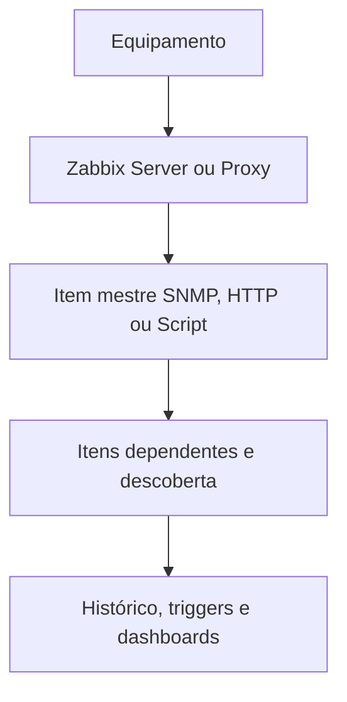
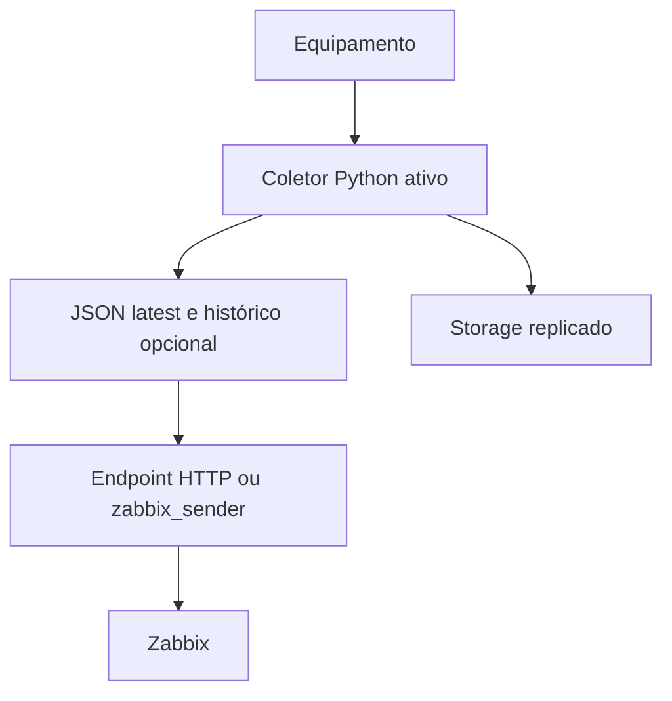

# Coleta direta no Zabbix 7.4 versus servidor central de normalização

Versão do documento: 1.0  
Objetivo: comparar prazo, complexidade, operação e tempo de detecção das duas arquiteturas.

## 1. Conclusão executiva

Para uma **entrega mínima em prazo curto**, a recomendação é:

1. usar coleta direta do Zabbix 7.4 para SNMP e APIs simples;
2. usar item mestre e itens dependentes para evitar uma consulta por métrica;
3. criar um normalizador externo apenas para as integrações cujo fluxo realmente seja complexo;
4. não colocar o servidor central, o CSV, o NFS espelhado e o failover entre sites como pré-requisitos da primeira entrega.

Portanto, a escolha recomendada não é totalmente direta nem totalmente centralizada. É um **modelo híbrido e incremental**:

- Avamar, Connectrix, Data Domain e PowerSwitch OS10: SNMPv3 direto;
- PowerScale e iDRAC: REST/Redfish direto;
- Unity: REST direto para saúde, capacidade, inventário e alertas; avaliar normalizador para performance;
- ECS: normalizador é recomendável para a Flux API e sua cardinalidade, mas o primeiro mínimo pode começar pelos recursos mais simples da Management API;
- PowerVault ME4: decidir durante a prova de conceito entre item Script do Zabbix e pequeno adaptador, devido ao login por hash/session key e às várias chamadas.

Essa estratégia atende primeiro o prazo e deixa a padronização completa para uma fase em que existam payloads reais e requisitos comprovados.

## 2. O que significa cada modelo

### 2.1 Coleta direta no Zabbix



O Zabbix Server ou Proxy consulta diretamente a interface oficial do equipamento. Um item mestre pode guardar uma resposta em lote; itens dependentes extraem as métricas sem repetir a chamada.

### 2.2 Servidor central de normalização



O coletor conhece a API ou MIB de cada fabricante, converte tudo para um schema comum e publica a última coleta. O Zabbix consulta esse JSON ou recebe o valor por trapper.

No cenário simplificado anteriormente discutido, esse serviço teria **duas VMs RHEL 9 no total**:

- uma VM preferencialmente ativa no Rio;
- uma VM de contingência em São Paulo;
- storage primário no Rio e réplica em São Paulo;
- um nome DNS apontando para o nó ativo.

Esse desenho é viável, mas oferece contingência entre sites, não alta disponibilidade local completa em cada site.

## 3. Comparação resumida

| Aspecto | Direto no Zabbix 7.4 | Servidor normalizador |
|---|---|---|
| Primeira entrega | Mais rápida | Mais lenta por exigir plataforma antes dos adaptadores |
| Componentes novos | Nenhum além do Zabbix/Proxy já existente | Aplicação, duas VMs, serviço HTTP, armazenamento, replicação, DNS/failover e monitoração própria |
| Agendamento | Nativo do Zabbix | `systemd timer`/scheduler do app mais o agendamento do Zabbix |
| SNMP | Nativo e adequado para descoberta em lote | Python nativo não implementa SNMP; exige Net-SNMP externo ou biblioteca adicional |
| REST simples | HTTP agent | `urllib.request`/`http.client` no Python e novo endpoint para o Zabbix |
| REST em várias etapas | Item Script pode atender, dentro dos limites do Zabbix | Mais natural de programar, testar e manter em Python |
| Normalização | Preprocessing/JavaScript do template | Adaptadores Python e schema comum |
| Descoberta | LLD do Zabbix | Coletor precisa gerar inventário normalizado, e o Zabbix ainda fará LLD |
| Histórico | Banco do Zabbix já guarda histórico e trends | Pode duplicar histórico em CSV, além do banco do Zabbix |
| Dados brutos | Podem ser mantidos no item mestre conforme retenção | Podem ser arquivados antes da normalização |
| Credenciais | Configuradas no Zabbix/Proxy conforme política | Concentradas no serviço/cofre do coletor |
| Carga no Zabbix | Polling e preprocessing usam Server/Proxy | Parte da autenticação, paginação e parsing sai do Zabbix |
| Debug | Dados, item e erro no mesmo produto | Melhor teste unitário do adaptador, mas diagnóstico atravessa duas plataformas |
| Upgrade de firmware | Pode exigir alteração de template | Pode ser absorvido pelo adaptador mantendo o JSON estável |
| Reuso fora do Zabbix | Menor | Maior para Grafana, data lake ou outra telemetria |
| Pontos de falha | Zabbix/Proxy, rede e equipamento | Todos os anteriores mais app, scheduler, arquivo, NFS, réplica, DNS e failover |
| Responsável | Principalmente equipe Zabbix | Exige dono de software e operação 24x7 do coletor |

## 4. Prós e contras da coleta direta

### Prós

- Menor caminho até produção.
- Menos servidores, serviços, certificados e runbooks.
- SNMP polling, SNMP traps, HTTP agent, Script item, preprocessing e descoberta já fazem parte do Zabbix.
- Um Zabbix Proxy pode executar a coleta perto dos equipamentos e armazenar temporariamente os dados se a comunicação com o Server cair.
- Item mestre mais itens dependentes permite uma coleta em lote e várias extrações.
- O estado de coleta, a fila, o histórico e os problemas ficam na mesma plataforma.
- Evita duplicar no CSV o histórico que o banco do Zabbix já mantém.
- Reduz o risco de o projeto de normalização bloquear a entrega mínima.

### Contras

- Cada template conhece detalhes do fabricante e da versão.
- Autenticação com token, cookie, CSRF, paginação e múltiplas chamadas pode deixar o item Script complexo.
- JavaScript de preprocessing é menos confortável que uma aplicação Python para grandes transformações.
- Atualização de API pode exigir modificar e reimportar o template.
- Respostas grandes podem aumentar processamento e armazenamento no Zabbix.
- Reuso dos dados por ferramentas externas fica menos natural.
- A equipe de templates também passa a manter parte da lógica de integração.

### Onde esse modelo funciona melhor

- SNMPv3 e traps;
- uma chamada HTTP que retorna JSON consistente;
- autenticação Basic ou header estático;
- descoberta simples por uma coleção;
- poucos passos e payload de tamanho controlado.

## 5. Prós e contras do servidor normalizador

### Prós

- O Zabbix recebe sempre o mesmo contrato, independentemente do fabricante.
- Autenticação, renovação de token, cookies, CSRF, paginação e retries ficam em código Python testável.
- Mudanças de firmware podem ser tratadas no adaptador sem alterar todos os consumidores.
- Facilita conservar resposta bruta sanitizada, tempo de coleta e metadados.
- Permite reutilizar os dados em outras plataformas.
- Pode limitar concorrência e aliviar polling/preprocessing do Zabbix.
- Erros de fornecedor podem ser traduzidos para um envelope comum sem perder o erro original.

### Contras

- O normalizador vira uma aplicação de produção e precisa de dono, ciclo de release, testes, backup, observabilidade e suporte.
- Duas VMs não resolvem sozinhas eleição do ativo, split-brain, DNS, promoção do storage e consistência dos arquivos.
- O Zabbix pode continuar lendo um JSON antigo com HTTP `200`; sem controle de idade, isso cria um falso estado saudável.
- Há dois agendadores e dois lugares de retry, o que pode duplicar chamadas.
- NFS indisponível pode interromper publicação mesmo quando o equipamento está saudável.
- CSV concorrente exige lock, rotação, retenção e recuperação após linha parcial.
- A replicação do storage determina o RPO dos arquivos; ela não torna gravações simultâneas seguras.
- Para SNMP, “somente bibliotecas nativas Python” não basta. É necessário usar Net-SNMP, uma biblioteca SNMP ou deixar a coleta SNMP no Zabbix.
- A equipe passa a diagnosticar uma cadeia maior: equipamento, coletor, arquivo, endpoint, Zabbix e template.

### Onde esse modelo se justifica

- API com login e token renovável;
- múltiplas chamadas correlacionadas;
- paginação extensa;
- Flux/CSV ou payload com alta cardinalidade;
- vários consumidores além do Zabbix;
- necessidade real de guardar dados brutos fora do banco do Zabbix;
- política que exija retirar credenciais dos templates;
- várias versões do mesmo produto que precisem produzir um contrato estável.

## 6. Cuidado especial com JSON e CSV

No modelo centralizado, os dois formatos têm funções diferentes:

| Arquivo | Função recomendada |
|---|---|
| `latest.json` | Fotografia atual que o Zabbix consulta |
| CSV diário | Evidência/histórico auxiliar, não fonte primária do estado atual |
| JSON bruto rotacionado | Diagnóstico temporário, somente se retenção e dados sensíveis forem aprovados |

O `latest.json` precisa conter pelo menos:

```json
{
  "schema_version": "1.0",
  "equipment_id": "ID_ESTAVEL",
  "equipment_type": "unity_xt",
  "collector_id": "collector-rio-01",
  "collected_at": "2026-09-11T10:00:00Z",
  "published_at": "2026-09-11T10:00:03Z",
  "source_status": "ok",
  "collection_duration_ms": 2830,
  "data": {}
}
```

Regras mínimas:

- escrever em arquivo temporário no mesmo filesystem;
- executar flush/fsync conforme o requisito;
- publicar com rename atômico, por exemplo `os.replace()`;
- nunca deixar o Zabbix ler um arquivo que ainda está sendo gravado;
- validar `schema_version`, `collected_at` e `source_status`;
- alarmar se a idade do JSON exceder o intervalo esperado;
- rotacionar CSV por data/equipamento;
- manter uma única instância escritora por equipamento;
- não usar lock de arquivo em storages replicados de forma assíncrona como mecanismo de eleição entre sites.

Sem o campo `collected_at`, o Zabbix pode consultar por horas um JSON antigo perfeitamente válido e continuar mostrando os últimos valores como se fossem atuais.

## 7. Tempos de implantação

### 7.1 Premissas das estimativas

Os números abaixo são estimativas de engenharia, não SLA. Consideram:

- acesso aos equipamentos já liberado;
- modelo, firmware, MIB e documentação conhecidos;
- uma pessoa homologando a coleta e outra equipe construindo templates em paralelo;
- somente monitoração mínima;
- testes realizados sem provocar falhas destrutivas em produção;
- ausência de atraso de firewall, conta, certificado, CAB ou fornecedor.

Se acesso, credenciais, MIBs ou amostras demorarem, o calendário pode dobrar mesmo sem mudança no esforço técnico.

### 7.2 Prazo por etapa

| Entrega | Direto no Zabbix | Com normalizador central |
|---|---:|---:|
| Padrão comum e primeiro host simples | 2–5 dias úteis | 10–20 dias úteis para o núcleo da plataforma |
| Família SNMP simples | 2–4 dias úteis | 4–7 dias úteis, incluindo adaptador/Net-SNMP |
| API REST simples | 3–6 dias úteis | 4–8 dias úteis por adaptador |
| API complexa, sessão e várias chamadas | 5–10 dias úteis | 6–12 dias úteis por adaptador |
| HA de duas VMs, DNS e failover manual testado | Não aplicável ao template | mais 5–10 dias úteis |
| Storage/replicação, retenção e recuperação | Não aplicável ao template | mais 5–10 dias úteis, dependendo da solução existente |
| Primeira onda de 3–4 famílias simples | 2–4 semanas | 4–7 semanas |
| Mínimo das nove famílias | aproximadamente 4–8 semanas | aproximadamente 8–14 semanas |

Esses prazos incluem descoberta, amostras, implementação e teste integrado básico. Não incluem correções encontradas pelo fabricante nem aquisição de infraestrutura.

### 7.3 Prazo aproximado por família

| Família | Caminho rápido | Estimativa inicial | Observação |
|---|---|---:|---|
| Avamar | SNMPv3 direto | 2–4 dias | REST de atividades pode virar fase adicional. |
| Connectrix B/C | SNMPv3 direto | 3–6 dias por plataforma | Fabric OS e Cisco MDS exigem mapeamentos separados. |
| Data Domain | SNMPv3 direto | 2–4 dias | A MIB da release precisa ser validada. |
| ECS | Management API mínima; Flux em fase própria | 6–12 dias | Normalizador traz maior benefício aqui. |
| PowerScale | REST direto | 3–6 dias | Usar versão e `?describe` do cluster. |
| PowerEdge/iDRAC | Redfish direto | 2–5 dias | Telemetry/licença pode ampliar o prazo. |
| PowerSwitch OS10 | SNMPv3 direto | 2–4 dias | MIBs e função real do switch definem o escopo. |
| PowerVault ME4 | prova de conceito Script versus adaptador | 4–8 dias | Sessão e comandos múltiplos são o ponto decisório. |
| Unity XT | REST direto para mínimo | 4–7 dias | Performance real-time pode acrescentar 3–6 dias. |

O prazo deve ser contado por combinação relevante de produto e firmware, não somente pelo nome comercial da família.

## 8. Tempo de detecção operacional

### 8.1 Fórmulas

Para polling direto:

```text
tempo_máximo_aproximado = intervalo_Zabbix + duração_da_chamada + processamento
```

Para normalizador consultado pelo Zabbix:

```text
tempo_máximo_aproximado = intervalo_coletor + duração_da_coleta
                         + publicação + intervalo_Zabbix + processamento
```

Para normalizador que envia imediatamente com `zabbix_sender`:

```text
tempo_máximo_aproximado = intervalo_coletor + duração_da_coleta
                         + tempo_de_envio
```

O tempo médio, quando o evento pode ocorrer em qualquer instante, costuma ficar próximo da metade da soma dos intervalos, acrescido do tempo real de execução. Isso é uma aproximação; filas, retries e timeout aumentam o valor.

### 8.2 Exemplos

| Cenário | Tempo máximo aproximado sem falha/retry |
|---|---:|
| Zabbix consulta o equipamento a cada 1 minuto | pouco mais de 1 minuto |
| Coletor consulta a cada 1 minuto e Zabbix consulta o JSON a cada 1 minuto | pouco mais de 2 minutos |
| Coletor consulta a cada 5 minutos e Zabbix consulta o JSON a cada 1 minuto | pouco mais de 6 minutos |
| Coletor consulta a cada 1 minuto e envia ao Zabbix ao terminar | pouco mais de 1 minuto |
| Trap SNMP recebida diretamente | normalmente segundos, dependendo da cadeia de trap |

### 8.3 Cadência sugerida

| Natureza | Direto | Centralizado por consulta | Centralizado por envio |
|---|---:|---:|---:|
| Acesso/saúde crítica | 1 min | coletor 1 min + Zabbix 30–60 s | coletor 1 min e envio imediato |
| Componentes | 3–5 min | coletor 3–5 min + Zabbix 1 min | coletor 3–5 min e envio imediato |
| Performance | 1–5 min | evitar dois intervalos longos | envio ao concluir é preferível |
| Capacidade | 10–15 min | coletor 10–15 min + Zabbix 1–5 min | envio ao concluir |
| Inventário/versão | 12–24 h | Zabbix pode ler o último JSON a cada 1 h | envio após atualização |
| Eventos | polling + trap | polling do coletor mais evento separado | trap direto ou envio imediato |

Para o modelo central, o Zabbix precisa monitorar duas idades diferentes:

- idade da última execução do coletor;
- idade da última amostra válida de cada equipamento.

## 9. Falhas adicionais introduzidas pelo normalizador

| Falha | Risco | Controle necessário |
|---|---|---|
| Coletor parado | Todos os JSONs ficam antigos | watchdog/systemd e monitoração externa |
| Uma rotina trava | Outras coletas podem atrasar | timeout por equipamento e isolamento de execução |
| Duas instâncias gravam | Corrupção, duplicidade ou ordem incorreta | eleição de escritor e fencing lógico |
| NFS indisponível | Publicação falha | spool local controlado e política de recuperação |
| Réplica SP atrasada | Perda dos últimos registros após failover | medir e declarar RPO real |
| DNS ainda aponta para Rio | Zabbix não encontra o standby | TTL definido e runbook de mudança |
| JSON antigo responde `200` | Falso verde | validar `collected_at` e expiração |
| CSV cresce indefinidamente | Espaço esgotado | rotação, retenção e compressão |
| Schema muda parcialmente | Métricas incorretas | versionamento e validação antes da publicação |
| Token/senha aparece em log | Incidente de segurança | redaction e armazenamento de segredo |

## 10. Duas VMs ou quatro VMs

Duas VMs são suficientes para um **modelo simples ativo/standby entre Rio e São Paulo**. Elas não entregam simultaneamente:

- redundância local dentro do Rio;
- redundância local dentro de São Paulo;
- manutenção de uma VM sem depender do outro site;
- coleta local independente em ambos os sites durante uma falha do enlace.

Quatro VMs só seriam justificadas se o requisito fosse manter um par local em cada site. Para a primeira versão, isso não é necessário.

Com duas VMs, uma meta realista é:

| Estratégia | RTO indicativo | Complexidade |
|---|---:|---|
| Failover manual documentado | 15–60 minutos | Menor |
| Failover semiautomático com validação humana | 5–20 minutos | Média |
| Failover automático | 1–5 minutos | Alta; exige eleição, prevenção de split-brain e storage consistente |

Os valores são objetivos de projeto, não garantias. O RTO deve ser comprovado em teste. O RPO dos arquivos será igual ou pior que o atraso real da replicação do storage.

## 11. Recomendação por fases

### Fase 1 — atender o prazo

- Coletar diretamente no Zabbix tudo que for SNMPv3 ou REST simples.
- Usar Zabbix Proxy no site remoto quando já fizer parte da arquitetura da equipe.
- Entregar saúde, disponibilidade, capacidade agregada, performance essencial e proteção aplicável.
- Usar traps para eventos críticos, mantendo polling de reconciliação.
- Não exigir CSV central, schema universal ou HA do normalizador.
- Guardar somente amostras sanitizadas da homologação fora do Zabbix.

### Fase 2 — tratar integrações complexas

- Criar adaptador para ECS Flux.
- Avaliar adaptador para Unity Performance real-time.
- Decidir com prova de conceito se ME4 fica em item Script ou adaptador.
- Acrescentar Avamar REST somente se SNMP não cobrir o requisito de atividades.
- Definir um envelope JSON pequeno, com versão e timestamp, usando dados reais.

### Fase 3 — centralização completa, somente se houver benefício comprovado

- Subir as duas VMs RHEL 9.
- Implementar serviço, scheduler, observabilidade e gestão de segredos.
- Testar failover Rio → São Paulo.
- Definir RPO/RTO do storage e DNS.
- Migrar adaptadores simples apenas se o ganho operacional compensar.

Não é obrigatório mover para o normalizador aquilo que já funciona bem por SNMP direto.

## 12. Critérios objetivos para decidir

Adotar o normalizador para uma família quando pelo menos uma destas condições existir:

- três ou mais consumidores precisam do mesmo dado;
- autenticação/paginação não cabe de forma sustentável no template;
- o payload exige correlação entre várias chamadas;
- versões diferentes precisam manter o mesmo contrato;
- existe exigência de retenção bruta fora do Zabbix;
- testes automatizados do adaptador são requisito;
- a carga da coleta direta foi medida e ficou excessiva.

Manter coleta direta quando:

- SNMPv3 cobre o mínimo;
- uma única chamada HTTP fornece o payload;
- só o Zabbix consome a informação;
- o prazo é o principal direcionador;
- a equipe não possui dono permanente para a nova aplicação.

## 13. Decisão recomendada para este projeto

| Pergunta | Resposta recomendada agora |
|---|---|
| Construir o servidor central antes dos templates mínimos? | Não. |
| Usar coleta direta no primeiro ciclo? | Sim. |
| Abandonar totalmente a ideia do normalizador? | Não. Aplicá-lo seletivamente. |
| Criar quatro VMs? | Não para a primeira versão. |
| Criar duas VMs imediatamente? | Somente quando o primeiro adaptador complexo for aprovado. |
| Usar CSV como fonte do Zabbix? | Não. Usar JSON atual ou envio; CSV apenas como histórico auxiliar. |
| Onde começar o normalizador? | ECS Flux; depois Unity Performance ou ME4 se a prova de conceito justificar. |

## 14. Referências oficiais do Zabbix 7.4

- [Zabbix 7.4 — HTTP agent](https://www.zabbix.com/documentation/7.4/en/manual/config/items/itemtypes/http)
- [Zabbix 7.4 — itens dependentes](https://www.zabbix.com/documentation/7.4/en/manual/config/items/itemtypes/dependent_items)
- [Zabbix 7.4 — itens Script](https://www.zabbix.com/documentation/7.4/en/manual/config/items/itemtypes/script)
- [Zabbix 7.4 — descoberta de OIDs SNMP](https://www.zabbix.com/documentation/7.4/en/manual/discovery/low_level_discovery/examples/snmp_oids_walk)
- [Zabbix 7.4 — Zabbix trapper](https://www.zabbix.com/documentation/7.4/en/manual/config/items/itemtypes/trapper)
- [Zabbix 7.4 — Zabbix Proxy](https://www.zabbix.com/documentation/7.4/en/manual/concepts/proxy)
- [Zabbix — SNMP traps](https://www.zabbix.com/documentation/current/en/manual/config/items/itemtypes/snmptrap)
